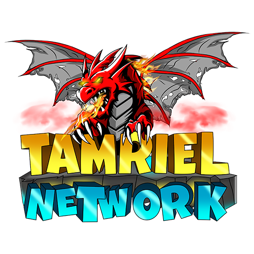

<!-- PROJECT SHIELDS -->

[![Contributors][contributors-shield]][contributors-url]
[![Forks][forks-shield]][forks-url]
[![Stargazers][stars-shield]][stars-url]
[![Issues][issues-shield]][issues-url]
[![MIT License][license-shield]][license-url]

<!-- PROJECT LOGO -->
<!--suppress ALL -->
 

  

<h3 align="center">papermc_plugins</h3>

  

    Collection of all my PaperMC plugins
     
    <a href="https://github.com/LeoMeinel/papermc_plugins"><strong>Explore the docs »</strong></a>
     
     
    <a href="https://github.com/LeoMeinel/papermc_plugins">View Demo</a>
    ·
    <a href="https://github.com/LeoMeinel/papermc_plugins/issues">Report Bug</a>
    ·
    <a href="https://github.com/LeoMeinel/papermc_plugins/issues">Request Feature</a>
  

<!-- ABOUT THE PROJECT -->

## About The Project

### Description

This is a collection of all my PaperMC plugins.

These plugins have different features that can be inspected on their GitHub page!

### Features

- [DropConfirm](https://github.com/LeoMeinel/DropConfirm)
- [GBooster](https://github.com/LeoMeinel/GBooster)
- [RandomSpawnTp](https://github.com/LeoMeinel/RandomSpawnTp)
- [SpecPlayer](https://github.com/LeoMeinel/SpecPlayer)
- [VitalBack](https://github.com/LeoMeinel/VitalBack)
- [VitalBroadcast](https://github.com/LeoMeinel/VitalBroadcast)
- [VitalCondense](https://github.com/LeoMeinel/VitalCondense)
- [VitalCraft](https://github.com/LeoMeinel/VitalCraft)
- [VitalEnchant](https://github.com/LeoMeinel/VitalEnchant)
- [VitalFeed](https://github.com/LeoMeinel/VitalFeed)
- [VitalFix](https://github.com/LeoMeinel/VitalFix)
- [VitalFly](https://github.com/LeoMeinel/VitalFly)
- [VitalHeal](https://github.com/LeoMeinel/VitalHeal)
- [VitalHome](https://github.com/LeoMeinel/VitalHome)
- [VitalKeepExp](https://github.com/LeoMeinel/VitalKeepExp)
- [VitalKeepInv](https://github.com/LeoMeinel/VitalKeepInv)
- [VitalMail](https://github.com/LeoMeinel/VitalMail)
- [VitalMotd](https://github.com/LeoMeinel/VitalMotd)
- [VitalPlayerTime](https://github.com/LeoMeinel/VitalPlayerTime)
- [VitalPlayerWeather](https://github.com/LeoMeinel/VitalPlayerWeather)
- [VitalRules](https://github.com/LeoMeinel/VitalRules)
- [VitalSeen](https://github.com/LeoMeinel/VitalSeen)
- [VitalSkull](https://github.com/LeoMeinel/VitalSkull)
- [VitalSpawn](https://github.com/LeoMeinel/VitalSpawn)
- [VitalSuicide](https://github.com/LeoMeinel/VitalSuicide)
- [VitalTp](https://github.com/LeoMeinel/VitalTp)
- [VitalTpa](https://github.com/LeoMeinel/VitalTpa)
- [VitalTrash](https://github.com/LeoMeinel/VitalTrash)
- [VitalWarp](https://github.com/LeoMeinel/VitalWarp)
- [VitalWelcome](https://github.com/LeoMeinel/VitalWelcome)

### Built With

- [Gradle 7](https://docs.gradle.org/7.5.1/release-notes.html)
- [OpenJDK 17](https://openjdk.java.net/projects/jdk/17/)

<!-- GETTING STARTED -->

## Roadmap

See the [open issues](https://github.com/LeoMeinel/papermc_plugins/issues) for a list of proposed features (and known
issues).

<!-- CONTRIBUTING -->

## Contributing

Contributions are what make the open source community such an amazing place to be, learn, inspire, and create. Any
contributions you make are **greatly appreciated**.

1. Fork the Project
2. Create your Feature Branch (`git checkout -b feature/AmazingFeature`)
3. Commit your Changes (`git commit -m 'Add some AmazingFeature'`)
4. Push to the Branch (`git push origin feature/AmazingFeature`)
5. Open a Pull Request

<!-- LICENSE -->

## License

Distributed under the GNU General Public License v3.0. See `LICENSE` for more information.

<!-- CONTACT -->

## Contact

Leopold Meinel - [leo@meinel.dev](mailto:leo@meinel.dev) - eMail

Project Link - [papermc_plugins](https://github.com/LeoMeinel/papermc_plugins) - GitHub

<!-- ACKNOWLEDGEMENTS -->

## Acknowledgements

- [README.md - othneildrew](https://github.com/othneildrew/Best-README-Template)

<!-- MARKDOWN LINKS & IMAGES -->

[contributors-shield]: https://img.shields.io/github/contributors-anon/LeoMeinel/papermc_plugins?style=for-the-badge
[contributors-url]: https://github.com/LeoMeinel/papermc_plugins/graphs/contributors
[forks-shield]: https://img.shields.io/github/forks/LeoMeinel/papermc_plugins?label=Forks&style=for-the-badge
[forks-url]: https://github.com/LeoMeinel/papermc_plugins/network/members
[stars-shield]: https://img.shields.io/github/stars/LeoMeinel/papermc_plugins?style=for-the-badge
[stars-url]: https://github.com/LeoMeinel/papermc_plugins/stargazers
[issues-shield]: https://img.shields.io/github/issues/LeoMeinel/papermc_plugins?style=for-the-badge
[issues-url]: https://github.com/LeoMeinel/papermc_plugins/issues
[license-shield]: https://img.shields.io/github/license/LeoMeinel/papermc_plugins?style=for-the-badge
[license-url]: https://github.com/LeoMeinel/papermc_plugins/blob/main/LICENSE
